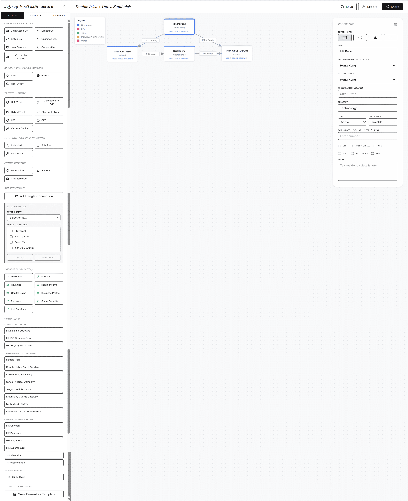
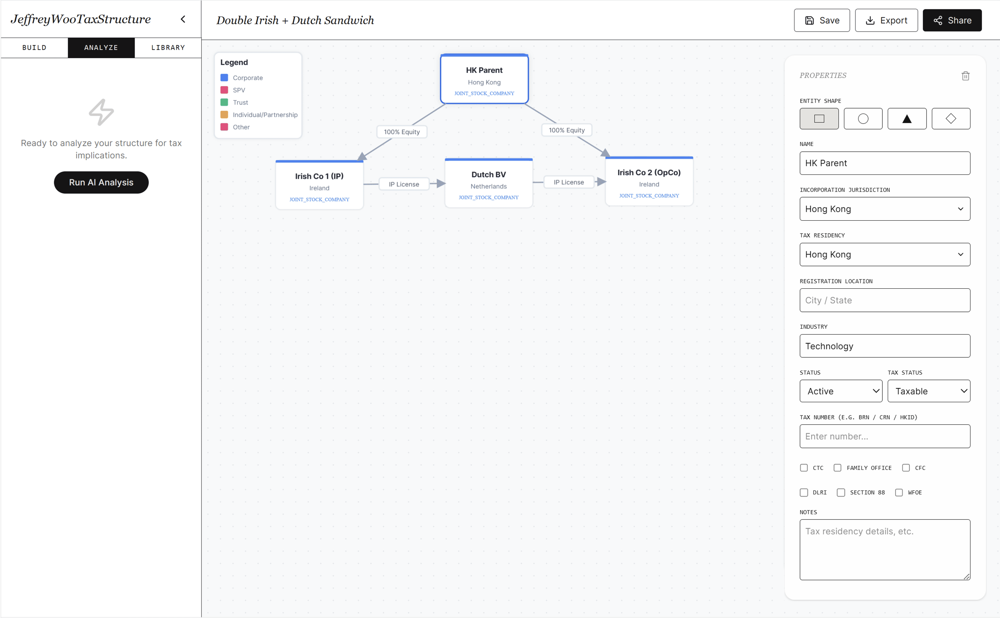
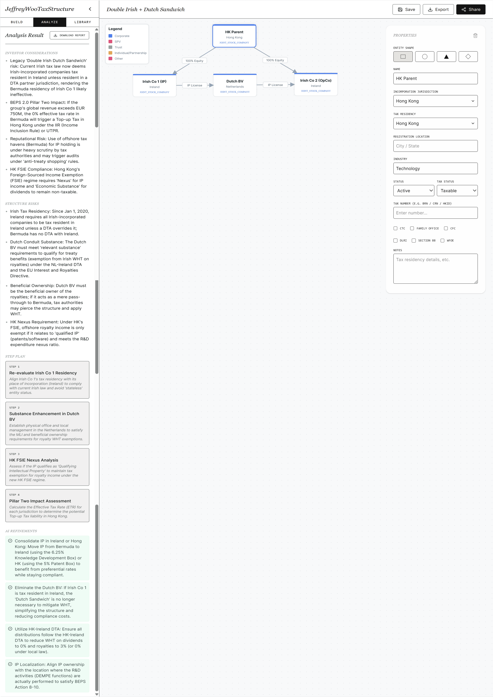
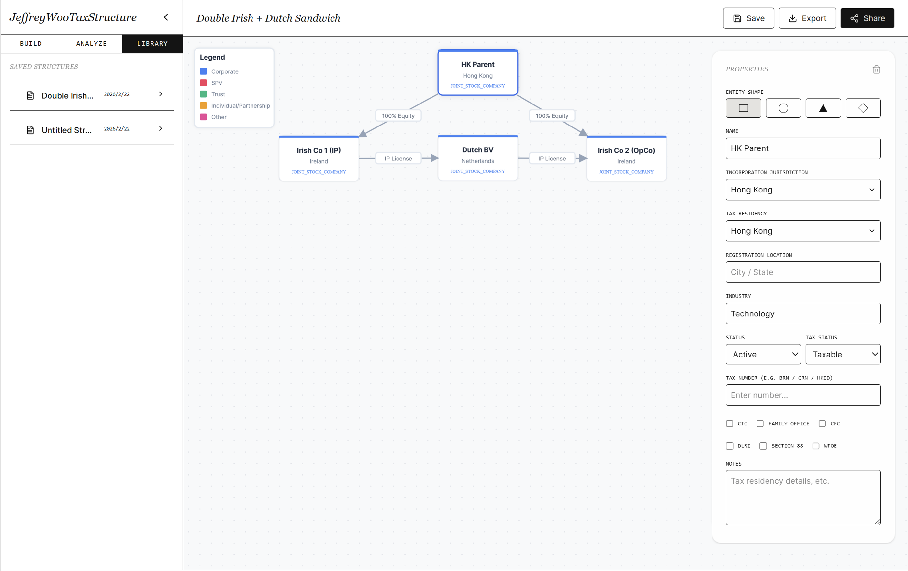

Not your typical diagramming tool.  

**JeffreyWooTaxStructure** is an innovative AI-powered tax structuring canvas app designed for tax professionals to design, analyze, and iterate complex tax structures on a single interactive canvas.

## ✨ What It Does
- 🏗️ **Entity Mapping** — drag-and-drop entities (equity, trust, debt, etc.) onto a free canvas  
- 🔗 **Relationship Design** — connect entities visually and logically to reflect ownership, funding, and control structures  
- 📑 **Step-by-Step Structuring** — build structuring plans progressively, not just end-state diagrams  
- 🧾 **Assumption Capture** — record key assumptions and tax considerations directly alongside visuals  
- ⚖️ **Tax Overlay** — surface tax implications directly on the chart for clarity and compliance  
- 📂 **Pre-Built Templates** — start quickly with common Hong Kong tax structures  
- 🌍 **International Tax Planning Templates** — access a comprehensive suite of cross-border structures, treaty/Double Taxation Agreement/Arrangement (DTA) layers, and multi-jurisdictional planning models  
- 💾 **My Structures Library** — save, edit, and reuse structures for future projects  
- 📤 **Export Options** — generate outputs in PDF, PNG, or share via link  

## 🤖 AI-Native Capabilities
- 📊 Interpret diagrams to highlight:
  - Investor considerations  
  - Structure considerations  
  - Downstream implications  
  - Draft step plans  
- 🧠 Suggest refinements based on Hong Kong tax rules and international treaty/DTA frameworks  
- 🌍 Expand to multi-jurisdictional entities, cross-border financing, and treaty/DTA optimization  

## 🚀 Why Choose JeffreyWooTaxStructure?
Most tools only draw charts. **JeffreyWooTaxStructure** goes further — combining visual design, tax analysis, and structured documentation in one intelligent workspace. With built-in **international tax planning templates**, it empowers professionals to handle both local and cross-border structuring needs with clarity and speed.

## 🤖 Tech Stack
- **Language** — TypeScript  
- **Framework** — React (with Vite as the build tool)  
- **UI** — Standard React components

## 📦 Getting Started
1. Clone the repository and install dependencies.  
2. Launch the app to access the interactive canvas.  
3. Drag-and-drop entities, connect relationships, and capture assumptions.  
4. Apply Hong Kong or international tax templates to accelerate structuring.  
5. Let the AI surface tax implications and suggest refinements.  
6. Export your structure to PDF, PNG, or save it in **My Structures** for future use.  

## ⚖️ Disclaimer
**JeffreyWooTaxStructure** provides AI-driven insights for **educational and professional support** only. It does not replace formal tax, legal, or financial advice. Users should consult chartered tax advisers (CTAs) before implementing any tax structures in practice.  

## ⚙️ Run Locally

**Prerequisites:**  Node.js

1. Install dependencies:
   `npm install`
2. Set the `GEMINI_API_KEY` in [.env.local](.env.local) file to your API key after you create [.env.local](.env.local) file
3. Run the app:
   `npm run dev`

## 📋 Sample

