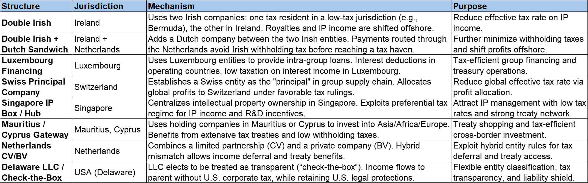
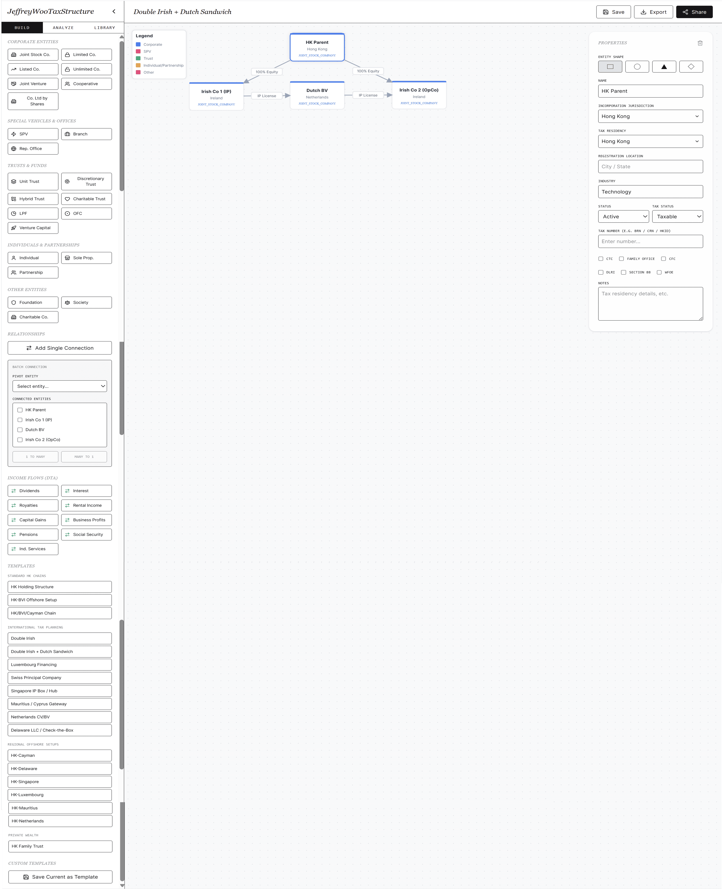
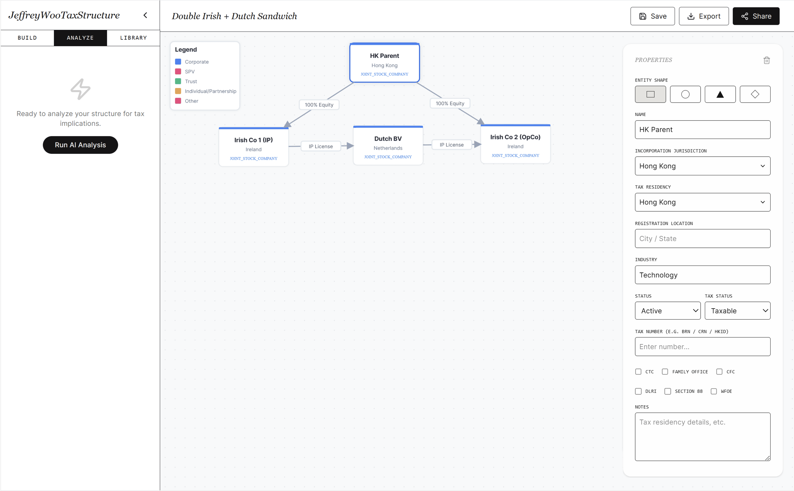
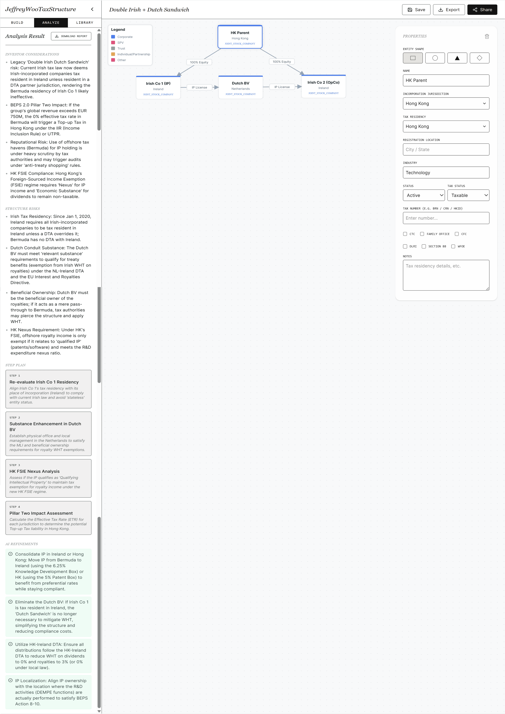
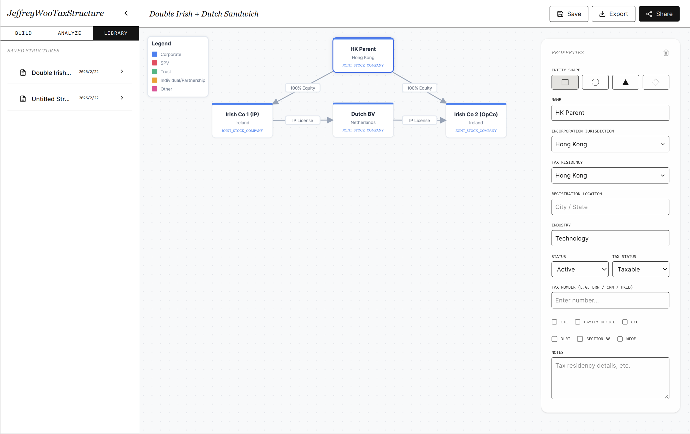

## 📊 Overview

> **Not your typical diagramming tool!**

**JeffreyWooTaxStructure** is an innovative AI-powered tax structuring canvas app designed for tax professionals to design, analyze, and iterate complex tax structures on a single interactive canvas.

## ✨ What It Does
- 🏗️ **Entity Mapping** — drag-and-drop entities (equity, trust, debt, etc.) onto a free canvas  
- 🔗 **Relationship Design** — connect entities visually and logically to reflect ownership, funding, and control structures  
- 📑 **Step-by-Step Structuring** — build structuring plans progressively, not just end-state diagrams  
- 🧾 **Assumption Capture** — record key assumptions and tax considerations directly alongside visuals  
- ⚖️ **Tax Overlay** — surface tax implications directly on the chart for clarity and compliance  
- 📂 **Pre-Built Templates** — start quickly with common Hong Kong and international tax structures  
- 🌍 **International Tax Planning Templates** — access a comprehensive suite of cross-border structures, Double Taxation Agreement/Arrangement (DTA) treaty layers, and multi-jurisdictional planning models  
- 💾 **My Structures Library** — save, edit, and reuse structures for future projects  
- 📤 **Export Options** — generate outputs in PNG, or share via link for the structure diagram, and TXT for the AI tax analysis result  

## 🤖 AI-Native Capabilities
- 📊 Analyze tax structure diagrams to highlight:
  - Investor considerations  
  - Structure considerations  
  - Downstream implications  
  - Draft step plans  
- 🧠 Suggest refinements based on Hong Kong tax rules and international DTA treaty frameworks  
- 🌍 Expand to multi-jurisdictional entities, cross-border financing, and DTA treaty optimization  

## 🚀 Why Choose JeffreyWooTaxStructure?
Most tools only draw charts. **JeffreyWooTaxStructure** goes further — combining visual design, tax analysis, and structured documentation in one intelligent workspace. With built-in **Hong Kong and international tax planning templates**, it empowers professionals to handle both local and cross-border structuring needs with clarity and speed.

## 🤖 Tech Stack
- **Language** — TypeScript, HTML  
- **Framework** — React (with Vite as the build tool)  
- **UI** — Standard React components (interactive canvas, drag-and-drop entities)
- **Runtime** — Node.js

## 💰 Professional Tax Concepts Considered
This app automates the visualization and analysis of complex cross-border tax structures, embedding Hong Kong and PRC tax regimes into an interactive, compliance-ready framework. It demonstrates both technical innovation and deep domain knowledge by incorporating:  
• 	**Corporate Treasury Centre (CTC)** — Profits tax concession for qualifying CTC, enabling multinational groups to centralize treasury operations, optimize liquidity, and enhance funding efficiency under the Inland Revenue (Amendment) (No.2) Ordinance 2016.  
• 	**Family-owned Investment Holding Vehicles (FIHV) / Family-owned Special Purpose Entities (FSPE)** — Profits tax concession regime under the Inland Revenue (Amendment) Ordinance 2023, strengthening Hong Kong’s position as a global family office and wealth management hub.  
• 	**Wholly Foreign-Owned Enterprise (WFOE)** — PRC market entry vehicle benefiting from tax concessions and regulatory compliance, essential for cross-border structuring under PRC Company Law, Foreign Investment Law (effective 2020), and the Wholly Foreign-Owned Enterprises Law (revised 2000).  
• 	**Controlled Foreign Corporations (CFC) Regime** — Anti-deferral rules addressing passive income and offshore profit shifting, particularly relevant for PRC outbound investment, under Enterprise Income Tax (EIT) Law, Article 45, and State Administration of Taxation (SAT) Circulars (2009, 2014, 2015).  
• 	**Designated Local Research Institution (DLRI)** — Enhanced tax deduction incentives for R&D activities in Hong Kong, supporting innovation and sustainable growth under the Inland Revenue Ordinance, Sections 16B (for in-house R&D) and 16C (for outsourced R&D), and Schedule 45.  
• 	**Charitable Organization Under Section 88 of the Inland Revenue Ordinance (IRO)** — Charitable exemptions providing tax relief for recognized charitable organization, integrating philanthropy into tax planning.

**Note:** Through AI-assisted analysis of CTC and FIHV structures, it helps multinational enterprises significantly reduce their effective tax rate and optimize group funding efficiency. Additionally, it automates complex CFC compliance processes, reducing the risk of penalties in cross-border operations.

## 📝 Main International Tax Planning Strategies

## 💡 Finance Transformation Impact
This project demonstrates how technology can reshape professional tax workflows by:  
• Digitizing complex structuring processes with interactive canvas design & visualization overlays.  
• Enhancing compliance & transparency through AI‑driven analysis aligned with HK regulations & international guidelines (OECD/UN Models, BEPS).  
• Improving efficiency & collaboration with editable libraries, exportable outputs & scenario‑based templates.  
• Driving digital transformation in tax advisory by turning manual processes into scalable & intelligent workflows.  
• Promoting responsible innovation with secure handling of sensitive tax data & assumptions.

## ⭐ Finance Skills Strengthened
• Full‑stack architecture for interactive tax structuring applications.  
• Secure handling of sensitive tax data, assumptions & environment variables.  
• AI model integration into real‑world tax analysis workflows based on HK & international guidelines.  
• Parsing & interpreting complex entity diagrams & multi‑jurisdictional templates.  
• Interactive canvas design, visualization overlays & state management in React.

## 📦 Getting Started
1. Clone the repository and install dependencies.  
2. Launch the app to access the interactive canvas.  
3. Drag-and-drop entities, connect relationships, and capture assumptions.  
4. Apply Hong Kong or international tax templates to accelerate structuring.  
5. Let the AI surface tax implications and suggest refinements.  
6. Export your structure to PDF, PNG, or save it in **My Structures** for future use.  

## ⚖️ Disclaimer
**JeffreyWooTaxStructure** provides AI-driven insights for **educational and professional support** only. It does not replace formal tax, legal, or financial advice. Users should consult Chartered Tax Advisers (CTAs) before implementing any tax structures in practice.  

## ⚙️ Run Locally

**Prerequisites:**  Node.js

1. Install dependencies:
   `npm install`
2. Set the `GEMINI_API_KEY` in [.env.local](.env.local) file after you create [.env.local](.env.local) file
3. Run the app:
   `npm run dev`

## 📋 Sample

**Note:** Actively monitoring and systematically incorporating the evolving tax regulations, including BEPS 2.0 and other tax regulation updates from Hong Kong and other major jurisdictions, to ensure forward-thinking compliance and proactive risk management.
